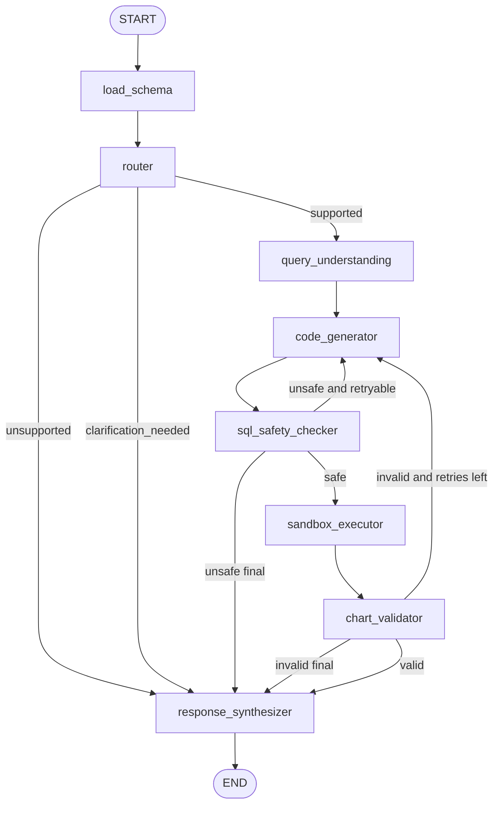

# Spec: Discogs Conversational Analytics Agent — V1

## 1. Purpose

Build a dockerized LangGraph-based conversational analytics agent for the Discogs dataset.

The agent receives natural language analytical questions, generates executable Python code with embedded DuckDB SQL, runs that code in a restricted subprocess sandbox, validates the produced Plotly HTML chart, persists the run, and returns a response with the generated artifact.

The agent must consume **only** the analytical DuckDB database produced by the existing ETL module.

---

## 2. Context

The ETL has already been implemented and publishes a DuckDB database with a stable analytical contract.

The agent module must not parse Discogs XML, must not read ETL staging/clean/intermediate parquet files, and must not modify the analytical dataset.

The agent is a separate module on top of the ETL output.

```text
Discogs XML dumps
  ↓
ETL offline pipeline
  ↓
data/published/duckdb/discogs.duckdb
  ↓
LangGraph conversational analytics agent
  ↓
Python + DuckDB SQL + Plotly HTML chart
```

---

## 3. V1 Goals

The V1 agent must:

- expose a FastAPI API;
- use LangGraph as the orchestration layer;
- implement a deterministic multi-node graph, not a free-form ReAct loop;
- classify queries by complexity;
- route simple and complex queries to different model tiers;
- generate Python code with embedded SQL;
- query the ETL-published DuckDB in read-only mode;
- execute generated code in a restricted subprocess sandbox;
- validate chart artifacts;
- persist threads, runs, tool calls, model usage, errors and artifacts in Postgres;
- support resuming a conversation by `thread_id`;
- run locally with Docker Compose;
- return Plotly HTML artifacts.

---

## 4. Non-goals for V1

Do not implement in V1:

- frontend UI;
- AWS deployment;
- RAG;
- MCP server;
- sandbox worker container;
- direct XML access;
- direct parquet access;
- ETL execution from the agent;
- chart editing;
- user authentication;
- multi-tenant security;
- production-grade code execution isolation.

---

## 5. Future Work

Potential future extensions:

- minimal frontend with:
  - text box for natural language queries;
  - predefined demo queries;
  - default plots;
  - Plotly HTML rendering;
  - run history by `thread_id`;
- AWS deployment;
- MCP wrappers for the local tools;
- RAG over:
  - data dictionary;
  - example queries;
  - ETL architectural decisions;
  - chart generation guidelines;
- separate sandbox-worker container with stronger filesystem and network isolation;
- Streamlit or React frontend;
- artifact gallery;
- S3 artifact storage.

---

## 6. Core Architectural Decisions

### 6.1 FastAPI from V1

The agent exposes a FastAPI API from the initial version.

Rationale:

- easier integration with a future frontend;
- clear API contract for `/query`;
- easier to demo;
- still allows CLI support as optional developer tooling.

---

### 6.2 Postgres from V1

Postgres is used for operational persistence:

- threads;
- runs;
- tool calls;
- model usage;
- errors;
- artifact metadata;
- optional LangGraph checkpoints.

Rationale:

- aligns with project requirements for durable persistence;
- supports thread resumption;
- makes traces inspectable;
- avoids ad-hoc file-only persistence.

---

### 6.3 Subprocess Sandbox

Generated Python code runs in a restricted subprocess.

Rationale:

- simpler than a dedicated sandbox worker container;
- acceptable for local academic/demo usage;
- supports timeout, environment restrictions and artifact path isolation;
- can be replaced later by a containerized sandbox without changing the LangGraph contract.

Trade-offs:

- weaker isolation than a separate container;
- not suitable for untrusted public usage;
- must be documented as a V1 trade-off.

---

### 6.4 Local Tools Instead of MCP

Tools are implemented as local Python functions/classes integrated with LangGraph.

Rationale:

- faster to implement;
- lower operational overhead;
- sufficient for V1;
- tools can later be wrapped as MCP endpoints if required.

---

### 6.5 No RAG in V1

RAG is explicitly excluded from the initial version.

Rationale:

- the agent works over a small, explicit DuckDB analytical contract;
- schema context can be injected directly into prompts;
- RAG would add complexity without being required for the core query-to-chart workflow.

Future RAG can be added over documentation, schema descriptions, example queries and architectural decisions.

---

### 6.6 LLM Generates Full Python Code

The code generator produces full Python code with embedded SQL.

Rationale:

- aligns with the project requirement of natural language to executable Python;
- supports flexible chart generation;
- keeps the agent architecture close to the intended query-to-chart workflow.

Required safeguards:

- DuckDB read-only connection;
- SQL allowlist;
- SQL operation restrictions;
- sandbox timeout;
- artifact path restrictions;
- no direct file access to XML/parquet;
- no network access;
- no package installation.

---

### 6.7 Plotly HTML Artifacts

Charts are generated with Plotly and stored as `.html`.

Rationale:

- easier to render later in a frontend;
- self-contained interactive artifacts;
- good fit for analytics demo.

---

## 7. ETL-to-Agent Data Contract

### 7.1 DuckDB Path

The agent must read the DuckDB generated by the ETL:

```text
data/published/duckdb/discogs.duckdb
```

The path must be configurable:

```text
ANALYTICS_DUCKDB_PATH=/app/data/published/duckdb/discogs.duckdb
```

In Docker, the DuckDB directory must be mounted read-only.

---

### 7.2 Authorized DuckDB Objects

The agent may query only the following published objects:

```text
release_fact
release_unique_view
release_artist_bridge
release_label_bridge
master_fact  # optional, only if available
```

The agent must not query:

```text
stg_*
clean_*
release_format_summary
raw XML
ETL parquet files
any external files
```

---

### 7.3 Table Semantics

#### `release_fact`

Grain:

```text
one row per release x style
```

Use for:

- style-level analysis;
- trends by style;
- style diversity;
- joins to labels/artists when style is needed.

Critical rule:

```text
Do not use COUNT(*) on release_fact to count releases.
Use COUNT(DISTINCT release_id), unless explicitly counting release-style rows.
```

---

#### `release_unique_view`

Grain:

```text
one row per release
```

Use for:

- release counts;
- releases by year;
- releases by decade;
- releases by country;
- releases by primary format;
- format comparisons;
- genre-level analysis using `primary_genre`.

---

#### `release_artist_bridge`

Grain:

```text
one row per release x main artist
```

Use for:

- top artists;
- collaborative releases;
- artist style diversity;
- artist rankings.

---

#### `release_label_bridge`

Grain:

```text
one row per release x label
```

Use for:

- top labels;
- label diversity;
- label trends by decade;
- label-country/style analysis.

---

#### `master_fact`

Grain:

```text
one row per master
```

Use for:

- works with most versions;
- analysis at work/master level;
- avoiding release/reissue bias.

This table is optional. The agent must detect whether it exists.

---

## 8. Recommended LangGraph Architecture

Use a deterministic `StateGraph`, not a free-form ReAct loop.

The graph should act as a compiler-like pipeline:

```text
natural language
  ↓
route
  ↓
analytical plan
  ↓
code generation
  ↓
safety validation
  ↓
execution
  ↓
chart validation
  ↓
response
```

---

### 8.1 Graph Nodes

Required nodes:

```text
load_schema
router
query_understanding
code_generator
sql_safety_checker
sandbox_executor
chart_validator
response_synthesizer
```

This exceeds the minimum requirement of 4 agents/nodes and gives explicit responsibilities.

---

### 8.2 Graph Flow

```text
START
  ↓
load_schema
  ↓
router
  ├── unsupported → response_synthesizer → END
  ├── clarification_needed → response_synthesizer → END
  └── supported → query_understanding
                    ↓
                code_generator
                    ↓
              sql_safety_checker
                    ├── unsafe and retryable → code_generator
                    ├── unsafe final → response_synthesizer → END
                    └── safe → sandbox_executor
                                  ↓
                              chart_validator
                                  ├── invalid and retries left → code_generator
                                  ├── invalid final → response_synthesizer → END
                                  └── valid → response_synthesizer → END
```

Mermaid diagram:



---

## 9. Node Specifications

### 9.1 `load_schema`

Responsibilities:

- connect to DuckDB read-only;
- list available tables/views;
- list columns and types;
- detect optional `master_fact`;
- build schema context for prompts.

Allowed tools:

```text
dataset_schema_reader
```

Output:

```json
{
  "available_tables": ["release_fact", "release_unique_view", "release_artist_bridge"],
  "has_master_fact": false,
  "schema_context": {
    "release_fact": [
      {"name": "release_id", "type": "BIGINT"},
      {"name": "style", "type": "VARCHAR"}
    ]
  }
}
```

---

### 9.2 `router`

Responsibilities:

- classify query complexity;
- select model tier;
- detect unsupported queries;
- detect clarification-needed queries.

Allowed tools:

```text
query_classifier
cost_logger
```

Output:

```json
{
  "complexity": "simple | complex | unsupported | clarification_needed",
  "selected_model": "cheap_model | strong_model",
  "rationale": "...",
  "requires_clarification": false
}
```

Routing categories:

#### Simple

Examples:

```text
Show releases by decade.
Top 10 countries by releases.
Distribution of primary formats.
Show Techno releases over time.
```

Characteristics:

- one main table/view;
- simple aggregation;
- simple filter;
- standard chart.

#### Complex

Examples:

```text
Which labels have the most stylistic diversity?
Detect outlier years for House releases.
Which styles grew the most from the 1990s to the 2000s?
Which countries are most specialized in Techno?
```

Characteristics:

- joins;
- window functions;
- CTEs;
- outlier detection;
- period comparisons;
- derived metrics.

#### Unsupported

Examples:

```text
What is the average price of Techno releases?
How many users want this release?
What is the rating by genre?
```

Reason:

These fields are not in the current DuckDB contract.

#### Clarification needed

Examples:

```text
Show me the best labels.
What are the most important genres?
```

Reason:

The metric is ambiguous.

---

### 9.3 `query_understanding`

Responsibilities:

- build an analytical plan;
- select tables;
- identify dimensions;
- identify metrics;
- identify filters;
- select chart type;
- include relevant data contract notes.

Allowed tools:

```text
dataset_schema_reader
```

Output:

```json
{
  "analysis_intent": "trend",
  "tables": ["release_fact"],
  "dimensions": ["year"],
  "metrics": [
    {
      "name": "releases",
      "aggregation": "count_distinct",
      "column": "release_id"
    }
  ],
  "filters": [
    {
      "column": "style",
      "operator": "=",
      "value": "Techno"
    }
  ],
  "chart_type": "line",
  "notes": "Use COUNT(DISTINCT release_id) because release_fact is release x style."
}
```

---

### 9.4 `code_generator`

Responsibilities:

- generate full executable Python code;
- embed DuckDB SQL;
- create a Plotly chart;
- save chart as HTML;
- create a global `RESULT` object.

Allowed tools:

```text
cost_logger
```

The node must not execute code.

The code must obey the code generation contract defined later in this spec.

---

### 9.5 `sql_safety_checker`

Responsibilities:

- extract SQL from generated code;
- verify only allowlisted tables are used;
- verify only read-only SQL is used;
- block direct file reads;
- block DuckDB extensions;
- block DDL/DML.

Allowed tools:

```text
sql_safety_checker
```

If unsafe and repairable, route back to `code_generator`.

If unsafe and not repairable, route to `response_synthesizer`.

---

### 9.6 `sandbox_executor`

Responsibilities:

- run generated code in restricted subprocess;
- apply timeout;
- control environment variables;
- capture stdout/stderr;
- capture exceptions;
- return `RESULT`;
- return artifact paths and dataframe preview.

Allowed tools:

```text
sandbox_executor
artifact_store
```

---

### 9.7 `chart_validator`

Responsibilities:

- verify execution success;
- verify `RESULT` exists;
- verify artifact path exists;
- verify artifact is an `.html` file;
- verify dataframe preview is structurally valid;
- verify chart type is acceptable;
- decide retry.

Allowed tools:

```text
chart_validator
```

Output:

```json
{
  "valid": true,
  "errors": [],
  "should_retry": false
}
```

Retry policy:

```text
max_retries = 2
```

---

### 9.8 `response_synthesizer`

Responsibilities:

- generate final user-facing response;
- include artifact reference;
- include concise insight;
- include SQL/code only when debug mode is enabled;
- explain unsupported or clarification cases;
- hide raw tracebacks from the user;
- persist final response.

Allowed tools:

```text
artifact_store
cost_logger
```

---

## 10. LangGraph State Contract

Recommended state:

```python
from typing import TypedDict, Any

class AgentState(TypedDict):
    thread_id: str
    run_id: str
    user_query: str
    messages: list[dict[str, Any]]

    schema_context: dict[str, Any]
    route: dict[str, Any]
    query_plan: dict[str, Any] | None

    generated_code: str | None
    generated_sql: str | None

    safety_result: dict[str, Any] | None
    execution_result: dict[str, Any] | None
    validation_result: dict[str, Any] | None

    artifact_paths: list[str]
    dataframe_preview: list[dict[str, Any]]

    retry_count: int
    max_retries: int

    errors: list[dict[str, Any]]
    model_usage: list[dict[str, Any]]
    trace_spans: list[dict[str, Any]]

    final_response: str | None
```

---

## 11. Tools

At least 5 tools must be implemented and invoked in traces.

V1 tools:

```text
dataset_schema_reader
query_classifier
sql_safety_checker
sandbox_executor
chart_validator
cost_logger
artifact_store
```

---

### 11.1 `dataset_schema_reader`

Responsibilities:

- connect to DuckDB read-only;
- list tables/views;
- list columns/types;
- detect `master_fact`;
- generate compact schema context.

Input:

```json
{
  "duckdb_path": "/app/data/published/duckdb/discogs.duckdb"
}
```

Output:

```json
{
  "tables": {
    "release_unique_view": [
      {"name": "release_id", "type": "BIGINT"},
      {"name": "decade", "type": "INTEGER"}
    ]
  },
  "has_master_fact": true,
  "warnings": []
}
```

---

### 11.2 `query_classifier`

Responsibilities:

- classify query;
- return model tier;
- return rationale.

Output:

```json
{
  "complexity": "simple",
  "selected_model": "cheap_model",
  "rationale": "Single table aggregation by decade."
}
```

---

### 11.3 `sql_safety_checker`

Responsibilities:

- allow only `SELECT` and `WITH`;
- block DDL/DML;
- block unsafe DuckDB functions;
- block unauthorized tables;
- block file access.

Output:

```json
{
  "allowed": true,
  "violations": []
}
```

---

### 11.4 `sandbox_executor`

Responsibilities:

- execute generated Python code;
- enforce timeout;
- return stdout/stderr;
- return `RESULT`.

Output:

```json
{
  "exit_code": 0,
  "stdout": "",
  "stderr": "",
  "result": {
    "sql": "SELECT ...",
    "chart_path": "/app/artifacts/thread/run/chart.html",
    "dataframe_preview": [],
    "row_count": 10
  }
}
```

---

### 11.5 `chart_validator`

Responsibilities:

- validate generated artifact;
- validate `RESULT`;
- validate dataframe preview;
- decide retry.

Output:

```json
{
  "valid": true,
  "errors": [],
  "should_retry": false
}
```

---

### 11.6 `cost_logger`

Responsibilities:

- record model usage;
- record latency;
- estimate cost;
- persist usage.

Output:

```json
{
  "logged": true
}
```

---

### 11.7 `artifact_store`

Responsibilities:

- store artifact metadata;
- resolve artifact path;
- optionally serve artifact via API.

Output:

```json
{
  "artifact_id": "uuid",
  "path": "/app/artifacts/thread/run/chart.html"
}
```

---

## 12. SQL Safety Contract

### 12.1 Allowed SQL

Allowed:

```sql
SELECT ...
WITH ...
```

Allowed tables/views:

```text
release_fact
release_unique_view
release_artist_bridge
release_label_bridge
master_fact
```

---

### 12.2 Forbidden SQL

Forbidden:

```sql
INSERT
UPDATE
DELETE
DROP
ALTER
CREATE
COPY
EXPORT
INSTALL
LOAD
ATTACH
DETACH
```

Forbidden DuckDB/file access:

```text
read_csv
read_parquet
read_json
glob
httpfs
s3
file system reads
```

Forbidden tables:

```text
stg_releases
clean_releases
release_format_summary
any table not explicitly allowlisted
```

---

### 12.3 Count Rule

Correct:

```sql
SELECT COUNT(*) FROM release_unique_view;
```

Correct:

```sql
SELECT COUNT(DISTINCT release_id) FROM release_fact;
```

Incorrect unless counting release-style rows:

```sql
SELECT COUNT(*) FROM release_fact;
```

---

## 13. Code Generation Contract

Generated Python must follow this shape:

```python
import duckdb
import pandas as pd
import plotly.express as px
from pathlib import Path

DB_PATH = "/app/data/published/duckdb/discogs.duckdb"
ARTIFACT_DIR = Path("/app/artifacts/{thread_id}/{run_id}")
ARTIFACT_DIR.mkdir(parents=True, exist_ok=True)

con = duckdb.connect(DB_PATH, read_only=True)

sql = """
SELECT decade, COUNT(*) AS releases
FROM release_unique_view
WHERE decade IS NOT NULL
GROUP BY decade
ORDER BY decade
"""

df = con.execute(sql).df()

fig = px.bar(df, x="decade", y="releases", title="Releases by decade")
chart_path = ARTIFACT_DIR / "chart.html"
fig.write_html(chart_path)

RESULT = {
    "sql": sql,
    "chart_path": str(chart_path),
    "dataframe_preview": df.head(20).to_dict(orient="records"),
    "row_count": len(df)
}
```

Required `RESULT` keys:

```text
sql
chart_path
dataframe_preview
row_count
```

Restrictions:

- no network calls;
- no package installation;
- no direct XML/parquet access;
- no writes outside artifact directory;
- no modification of DuckDB;
- only allowed tables/views;
- DuckDB connection must be read-only.

---

## 14. Persistence Model

Use Postgres.

### 14.1 `agent_threads`

```text
thread_id
created_at
updated_at
status
metadata_json
```

### 14.2 `agent_runs`

```text
run_id
thread_id
user_query
complexity
selected_model
status
started_at
finished_at
latency_ms
final_response
```

### 14.3 `agent_tool_calls`

```text
tool_call_id
run_id
node_name
tool_name
input_json
output_json
status
latency_ms
error_message
created_at
```

### 14.4 `agent_model_usage`

```text
usage_id
run_id
node_name
model_name
prompt_tokens
completion_tokens
total_tokens
estimated_cost
latency_ms
created_at
```

### 14.5 `agent_artifacts`

```text
artifact_id
run_id
thread_id
artifact_type
path
metadata_json
created_at
```

### 14.6 `agent_errors`

```text
error_id
run_id
node_name
error_type
error_message
traceback
created_at
```

---

## 15. API Contract

### 15.1 `POST /query`

Request:

```json
{
  "thread_id": "optional-existing-thread-id",
  "message": "Show Techno releases by decade",
  "debug": false
}
```

Response:

```json
{
  "thread_id": "...",
  "run_id": "...",
  "response": "Generated a chart showing Techno releases by decade.",
  "chart_artifact": {
    "artifact_id": "...",
    "path": "/artifacts/..."
  },
  "sql": "SELECT ...",
  "dataframe_preview": [],
  "route": {
    "complexity": "simple",
    "selected_model": "cheap_model"
  }
}
```

If `debug = false`, the API may omit generated code but should still return SQL if useful.

---

### 15.2 `GET /threads/{thread_id}`

Returns:

- thread metadata;
- previous runs;
- artifact metadata.

---

### 15.3 `GET /runs/{run_id}`

Returns:

- route;
- query plan;
- generated SQL;
- generated code if debug/admin mode;
- execution result;
- validation result;
- tool calls;
- errors;
- artifacts.

---

### 15.4 `GET /artifacts/{artifact_id}`

Returns or serves the Plotly HTML artifact.

---

### 15.5 `GET /health`

Returns:

```json
{
  "status": "ok",
  "duckdb_available": true,
  "postgres_available": true
}
```

---

## 16. CLI Contract

Optional but useful for local development.

```bash
python -m discogs_agent.cli query "Show releases by decade"
```

With thread:

```bash
python -m discogs_agent.cli query \
  "Compare Vinyl and CD releases by decade" \
  --thread-id demo-thread
```

Debug:

```bash
python -m discogs_agent.cli query \
  "Which labels have the most stylistic diversity?" \
  --show-sql \
  --show-code
```

---

## 17. Docker Contract

### 17.1 Services

```text
agent-api
postgres
```

No frontend in V1.

Future:

```text
frontend
sandbox-worker
```

---

### 17.2 Volumes

```text
./data/published/duckdb:/app/data/published/duckdb:ro
./artifacts:/app/artifacts
postgres_data:/var/lib/postgresql/data
```

---

### 17.3 Environment Variables

```text
OPENAI_API_KEY
CHEAP_MODEL
STRONG_MODEL
ANALYTICS_DUCKDB_PATH
DATABASE_URL
ARTIFACTS_DIR
MAX_RETRIES
SANDBOX_TIMEOUT_SECONDS
```

Recommended defaults:

```text
MAX_RETRIES=2
SANDBOX_TIMEOUT_SECONDS=30
ARTIFACTS_DIR=/app/artifacts
ANALYTICS_DUCKDB_PATH=/app/data/published/duckdb/discogs.duckdb
```

---

### 17.4 Startup

```bash
docker compose up --build
```

---

## 18. Suggested Project Structure

```text
agent/
  pyproject.toml
  Dockerfile
  README.md

  src/
    discogs_agent/
      __init__.py
      cli.py
      api.py

      graph/
        state.py
        builder.py
        nodes/
          load_schema.py
          router.py
          query_understanding.py
          code_generator.py
          sql_safety_checker.py
          sandbox_executor.py
          chart_validator.py
          response_synthesizer.py

      tools/
        dataset_schema_reader.py
        query_classifier.py
        sql_safety_checker.py
        sandbox_executor.py
        chart_validator.py
        cost_logger.py
        artifact_store.py

      prompts/
        router.md
        query_understanding.md
        code_generator.md
        repair_code.md
        response_synthesizer.md

      persistence/
        db.py
        repositories.py
        models.py
        migrations/

      sandbox/
        runner.py
        restrictions.py

      duckdb/
        schema.py
        allowlist.py

      observability/
        logging.py
        tracing.py
        cost.py

  tests/
    unit/
      test_router.py
      test_sql_safety_checker.py
      test_schema_reader.py
      test_chart_validator.py
    integration/
      test_agent_simple_query.py
      test_agent_complex_query.py
      test_resume_thread.py
      test_duckdb_contract.py
```

Root-level:

```text
docker-compose.yml
```

---

## 19. Prompt Contracts

### 19.1 Router Prompt

Must include:

- available tables;
- field availability;
- unsupported metrics;
- simple vs complex examples;
- model tier selection rules;
- instruction not to invent unavailable fields.

---

### 19.2 Query Understanding Prompt

Must include:

- DuckDB table grains;
- when to use `release_unique_view`;
- when to use `release_fact`;
- when to use artist/label bridges;
- optional `master_fact` logic;
- expected JSON output format.

---

### 19.3 Code Generator Prompt

Must include:

- schema context;
- allowed tables;
- SQL safety restrictions;
- code generation contract;
- required `RESULT`;
- artifact directory;
- DuckDB read-only connection;
- Plotly HTML requirement;
- count rule for `release_fact`.

---

### 19.4 Repair Prompt

Must include:

- original query;
- query plan;
- generated code;
- extracted SQL;
- execution error;
- validation error;
- schema context;
- instruction to minimally repair the code.

---

### 19.5 Response Synthesizer Prompt

Must include:

- user query;
- route;
- validation result;
- artifact metadata;
- dataframe preview;
- generated SQL;
- instruction to be concise;
- instruction to explain unsupported queries clearly.

---

## 20. Example Supported Queries and Expected SQL

### 20.1 Releases by decade

User:

```text
Show releases by decade.
```

Expected SQL:

```sql
SELECT decade, COUNT(*) AS releases
FROM release_unique_view
WHERE decade IS NOT NULL
GROUP BY decade
ORDER BY decade;
```

---

### 20.2 Techno over time

User:

```text
Show the evolution of Techno releases over time.
```

Expected SQL:

```sql
SELECT year, COUNT(DISTINCT release_id) AS releases
FROM release_fact
WHERE style = 'Techno'
  AND year IS NOT NULL
GROUP BY year
ORDER BY year;
```

---

### 20.3 Vinyl vs CD by decade

User:

```text
Compare Vinyl and CD releases by decade.
```

Expected SQL:

```sql
SELECT
  decade,
  'Vinyl' AS format,
  COUNT(*) AS releases
FROM release_unique_view
WHERE has_vinyl = TRUE
  AND decade IS NOT NULL
GROUP BY decade

UNION ALL

SELECT
  decade,
  'CD' AS format,
  COUNT(*) AS releases
FROM release_unique_view
WHERE has_cd = TRUE
  AND decade IS NOT NULL
GROUP BY decade

ORDER BY decade, format;
```

---

### 20.4 Label style diversity

User:

```text
Which labels have the most stylistic diversity?
```

Expected SQL:

```sql
SELECT
  l.label_name,
  COUNT(DISTINCT f.style) AS distinct_styles,
  COUNT(DISTINCT f.release_id) AS releases
FROM release_label_bridge l
JOIN release_fact f
  ON l.release_id = f.release_id
WHERE l.label_name IS NOT NULL
  AND f.style IS NOT NULL
GROUP BY l.label_name
HAVING COUNT(DISTINCT f.release_id) >= 10
ORDER BY distinct_styles DESC, releases DESC
LIMIT 20;
```

---

### 20.5 House outlier years

User:

```text
Detect outlier years for House releases.
```

Expected SQL:

```sql
WITH yearly_counts AS (
  SELECT
    year,
    COUNT(DISTINCT release_id) AS releases
  FROM release_fact
  WHERE style = 'House'
    AND year IS NOT NULL
  GROUP BY year
),
stats AS (
  SELECT
    AVG(releases) AS avg_releases,
    STDDEV_SAMP(releases) AS stddev_releases
  FROM yearly_counts
)
SELECT
  y.year,
  y.releases,
  (y.releases - s.avg_releases) / NULLIF(s.stddev_releases, 0) AS z_score
FROM yearly_counts y
CROSS JOIN stats s
WHERE ABS((y.releases - s.avg_releases) / NULLIF(s.stddev_releases, 0)) >= 2
ORDER BY ABS(z_score) DESC;
```

---

### 20.6 Works with most versions

Only if `master_fact` exists.

User:

```text
Which works have the most versions?
```

Expected SQL:

```sql
SELECT title, release_count
FROM master_fact
WHERE title IS NOT NULL
ORDER BY release_count DESC
LIMIT 20;
```

---

## 21. Testing Strategy

The agent must be tested with a layered strategy.

---

### 21.1 Unit Tests

#### Router tests

Cases:

```text
"Show releases by decade" → simple
"Which labels have the most stylistic diversity?" → complex
"Detect outlier years for House releases" → complex
"What is the average price of Techno releases?" → unsupported
"Show me the best labels" → clarification_needed
```

Assertions:

```text
complexity is correct
selected_model is correct
rationale is not empty
unsupported queries do not invoke code generation
```

---

#### Query understanding tests

Example input:

```text
Show the evolution of Techno releases over time.
```

Expected semantic plan:

```json
{
  "intent": "trend",
  "tables": ["release_fact"],
  "dimensions": ["year"],
  "metrics": [
    {
      "aggregation": "count_distinct",
      "column": "release_id"
    }
  ],
  "filters": [
    {
      "column": "style",
      "operator": "=",
      "value": "Techno"
    }
  ],
  "chart_type": "line"
}
```

---

#### SQL safety checker tests

Allow:

```sql
SELECT decade, COUNT(*) AS releases
FROM release_unique_view
GROUP BY decade;
```

Allow:

```sql
WITH counts AS (
  SELECT style, COUNT(DISTINCT release_id) AS releases
  FROM release_fact
  GROUP BY style
)
SELECT * FROM counts;
```

Block:

```sql
DROP TABLE release_fact;
```

Block:

```sql
CREATE TABLE x AS SELECT * FROM release_fact;
```

Block:

```sql
COPY release_fact TO '/tmp/out.csv';
```

Block:

```sql
SELECT * FROM read_parquet('/app/data/clean/clean_releases.parquet');
```

Block:

```sql
INSTALL httpfs;
LOAD httpfs;
```

Block:

```sql
ATTACH 'other.duckdb';
```

Block unauthorized tables:

```sql
SELECT * FROM clean_releases;
SELECT * FROM stg_releases;
```

---

#### Code generation contract tests

Use fixed generated-code fixtures, not real LLM calls.

Assertions:

```text
RESULT exists
RESULT.sql exists
RESULT.chart_path exists
RESULT.dataframe_preview exists
RESULT.row_count exists
chart_path exists
chart_path ends with .html
code connects to DuckDB read-only
```

---

### 21.2 Integration Tests

Use a small DuckDB fixture generated from the ETL contract.

Recommended fixture:

```text
tests/fixtures/discogs_test.duckdb
```

It must contain:

```text
release_fact
release_unique_view
release_artist_bridge
release_label_bridge
master_fact optional
```

---

#### Simple query integration test

Input:

```text
Show releases by decade.
```

Expected:

```text
route = simple
SQL uses release_unique_view
sandbox exit_code = 0
Plotly HTML artifact generated
run persisted in Postgres
tool calls persisted
```

---

#### Style trend integration test

Input:

```text
Show the evolution of Techno releases over time.
```

Expected SQL pattern:

```text
FROM release_fact
WHERE style = 'Techno'
COUNT(DISTINCT release_id)
```

Assertions:

```text
uses release_fact
uses COUNT(DISTINCT release_id)
does not use COUNT(*)
chart generated
```

---

#### Label diversity integration test

Input:

```text
Which labels have the most stylistic diversity?
```

Expected:

```text
route = complex
SQL joins release_label_bridge and release_fact
COUNT(DISTINCT style)
COUNT(DISTINCT release_id)
chart generated
```

---

#### Master fact optional test

Case A: DuckDB has `master_fact`.

Input:

```text
Which works have the most versions?
```

Expected:

```text
uses master_fact
generates ranking
```

Case B: DuckDB does not have `master_fact`.

Expected:

```text
controlled response says master_fact is unavailable
no raw exception
no invented answer
```

---

### 21.3 LangGraph Path Tests

#### Unsupported query exits early

Input:

```text
What is the average lowest price by genre?
```

Expected path:

```text
load_schema → router → response_synthesizer → END
```

Assertions:

```text
code_generator not invoked
sandbox_executor not invoked
response explains price is unavailable
```

---

#### Clarification-needed exits early

Input:

```text
Show me the best labels.
```

Expected path:

```text
load_schema → router → response_synthesizer → END
```

Expected response asks whether “best” means:

```text
release count
style diversity
growth over time
country coverage
```

---

#### Retry on execution error

Force first generated SQL to fail:

```sql
SELECT decadee, COUNT(*) FROM release_unique_view GROUP BY decadee;
```

Expected path:

```text
code_generator
→ sql_safety_checker
→ sandbox_executor
→ chart_validator
→ code_generator retry
→ sandbox_executor
→ chart_validator
→ response_synthesizer
```

Assertions:

```text
retry_count = 1
error persisted
second attempt succeeds
```

---

#### Retry limit reached

Force all attempts to fail.

Expected:

```text
retry_count = max_retries
final_response contains controlled failure
full traceback persisted internally
full traceback not exposed to user
```

---

### 21.4 Persistence Tests

#### Thread resume

Flow:

1. send query with `thread_id = demo-thread`;
2. restart service or simulate new instance;
3. send another query with same `thread_id`.

Expected:

```text
same conversation recovered
previous runs available
new run associated with same thread_id
```

Assertions:

```text
agent_threads has thread_id
agent_runs has two runs for thread_id
GET /threads/{thread_id} returns both
```

---

#### Tool call persistence

For a successful query, persist tool calls for:

```text
dataset_schema_reader
query_classifier
sql_safety_checker
sandbox_executor
chart_validator
artifact_store
cost_logger
```

Assertions:

```text
tool_name present
status present
latency_ms not null
input_json not null
output_json not null
```

---

#### Artifact persistence

After a successful query:

```text
agent_artifacts contains chart.html
artifact path exists
artifact belongs to thread_id and run_id
```

---

### 21.5 Data Contract Tests

#### No raw/clean/staging access

Block code or SQL attempting to read:

```text
data/raw
data/staging
data/clean
data/analytics/*.parquet
```

Expected:

```text
sql_safety_checker or sandbox restrictions block execution
```

---

#### Only published DuckDB objects

Allowed:

```text
release_fact
release_unique_view
release_artist_bridge
release_label_bridge
master_fact
```

Blocked:

```text
clean_releases
stg_releases
release_format_summary
```

---

#### Count rule enforcement

Input:

```text
How many releases are there by style?
```

Expected SQL:

```sql
COUNT(DISTINCT release_id)
FROM release_fact
```

Not:

```sql
COUNT(*)
FROM release_fact
```

---

### 21.6 Golden Query Tests

Maintain a YAML or JSON list of canonical test cases.

Example:

```yaml
- id: releases_by_decade
  query: Show releases by decade
  expected_route: simple
  expected_tables:
    - release_unique_view
  expected_chart_type: bar

- id: techno_over_time
  query: Show the evolution of Techno releases over time
  expected_route: simple
  expected_tables:
    - release_fact
  expected_sql_contains:
    - COUNT(DISTINCT release_id)
    - style = 'Techno'
  expected_chart_type: line

- id: label_diversity
  query: Which labels have the most stylistic diversity?
  expected_route: complex
  expected_tables:
    - release_label_bridge
    - release_fact
  expected_chart_type: bar

- id: house_outliers
  query: Detect outlier years for House releases
  expected_route: complex
  expected_sql_contains:
    - STDDEV_SAMP
    - z_score
  expected_chart_type: scatter

- id: unsupported_prices
  query: What is the average price by genre?
  expected_route: unsupported
  expected_no_code_generation: true
```

---

### 21.7 LLM Testing Policy

Do not make all tests depend on live LLM calls.

#### Unit tests

Use stubs/fakes:

```text
FakeRouterModel
FakeCodeGeneratorModel
FakeRepairModel
```

#### Optional LLM smoke tests

Gated behind env var:

```bash
RUN_LLM_TESTS=true pytest tests/llm
```

Do not run LLM tests by default in CI.

Rationale:

- cost;
- latency;
- non-determinism;
- fragility.

---

### 21.8 Docker Smoke Test

Provide a script:

```text
scripts/smoke_test_docker.sh
```

Expected actions:

```bash
docker compose up --build -d
curl http://localhost:8000/health
curl -X POST http://localhost:8000/query \
  -H "Content-Type: application/json" \
  -d '{"message": "Show releases by decade"}'
```

Assertions:

```text
agent-api starts
postgres starts
DuckDB path is available
artifacts dir is writable
/query returns run_id
/query returns chart artifact
```

---

## 22. Acceptance Criteria

### Functional

- User can send natural language question through `POST /query`.
- Agent returns natural language response.
- Agent generates SQL and Python.
- Agent executes code against DuckDB.
- Agent returns Plotly HTML artifact.
- Agent supports `thread_id`.
- Agent persists run metadata.
- Agent runs locally via Docker Compose.

---

### LangGraph

- Graph has at least 4 nodes.
- Graph has explicit routing.
- Graph has explicit exit conditions.
- Graph has retry path.
- Graph can finalize successful and failed runs.
- Graph state can be persisted or reconstructed by `thread_id`.

---

### Tools

- At least 5 tools are implemented.
- Tools are allow-listed per node.
- Tool calls are recorded in traces/persistence.
- Tools include:
  - schema reader;
  - query classifier;
  - SQL safety checker;
  - sandbox executor;
  - chart validator.

---

### Persistence

- Threads are persisted.
- Runs are persisted.
- Tool calls are persisted.
- Model usage is persisted.
- Errors are persisted.
- Artifacts are persisted.
- A second query can resume a previous `thread_id`.

---

### Data Contract

- Agent only queries DuckDB published surface.
- Agent does not access XML.
- Agent does not access staging/clean parquet.
- Agent follows `release_fact` count rule.
- Agent detects optional `master_fact`.

---

### Docker

- `docker compose up --build` starts:
  - `agent-api`;
  - `postgres`.
- DuckDB is mounted read-only.
- Artifacts directory is writable.
- `/health` returns OK.
- `/query` works against mounted DuckDB.

---

## 23. Implementation Phases

### Phase 1 — Skeleton

Tasks:

- create `agent/` package;
- add FastAPI app;
- add `/health`;
- add Dockerfile;
- add docker-compose Postgres + agent-api;
- add DuckDB schema reader;
- add Postgres connection;
- add basic config/env handling.

Done:

```text
API starts in Docker and can inspect DuckDB schema.
```

---

### Phase 2 — LangGraph Basic Flow

Tasks:

- define `AgentState`;
- build `StateGraph`;
- implement `load_schema`;
- implement router stub;
- implement query understanding stub;
- implement response synthesizer;
- persist runs.

Done:

```text
A query goes through LangGraph and returns a mocked analytical plan.
```

---

### Phase 3 — Real Code Generation and Execution

Tasks:

- implement code generator;
- implement SQL extraction;
- implement SQL safety checker;
- implement subprocess sandbox;
- implement artifact directory handling;
- implement Plotly HTML generation contract.

Done:

```text
A simple query generates a real Plotly chart from DuckDB.
```

---

### Phase 4 — Validation and Retry

Tasks:

- implement chart validator;
- implement repair prompt;
- implement retry loop;
- persist execution errors;
- return controlled failure when retries exhausted.

Done:

```text
Broken generated code can be retried and either repaired or reported cleanly.
```

---

### Phase 5 — Persistence and Observability

Tasks:

- persist tool calls;
- persist model usage;
- persist artifacts;
- persist errors;
- add structured logs;
- add cost estimates;
- add `/runs/{run_id}`;
- add `/threads/{thread_id}`.

Done:

```text
A full run is inspectable through API and database.
```

---

### Phase 6 — Demo Readiness

Tasks:

- add golden demo queries;
- add README;
- add Docker smoke test;
- add sample artifacts;
- document architecture;
- document trade-offs.

Done:

```text
Project can be demonstrated end-to-end locally with Docker Compose.
```

---

## 24. Executive Summary for Coding Agent

Build a dockerized FastAPI + LangGraph conversational analytics agent for the Discogs dataset. The agent must consume only the DuckDB database produced by the ETL at `data/published/duckdb/discogs.duckdb`. The graph must be deterministic and structured as: `load_schema → router → query_understanding → code_generator → sql_safety_checker → sandbox_executor → chart_validator → response_synthesizer`. Generated code is full Python with embedded SQL, executed in a restricted subprocess sandbox, and must output a Plotly HTML chart plus a global `RESULT` object. Postgres is required for threads, runs, tool calls, model usage, artifacts and errors. No RAG, no MCP, no frontend and no AWS deployment are required for V1. The agent must respect the ETL data contract, especially the `release_fact` grain rule: use `COUNT(DISTINCT release_id)` or `release_unique_view` for release counts.
